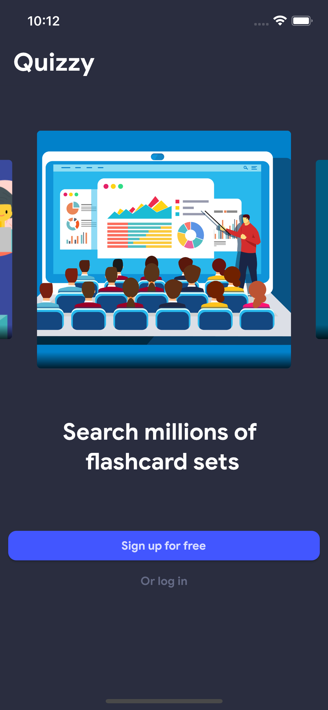

<!-- <div id="top"></div> -->
<!-- [![Contributors][contributors-shield]][contributors-url] -->
<!-- [![Forks][forks-shield]][forks-url] -->
<!-- [![Stargazers][stars-shield]][stars-url] -->
<!-- [![Issues][issues-shield]][issues-url] -->
<!-- [![MIT License][license-shield]][license-url] -->
<!-- [![LinkedIn][linkedin-shield]][linkedin-url] -->

<br />
<div align="center">
  <a href="https://github.com/vanh2604/quizlet-clone">
    
  </a>

<h3 align="center">Quizzy | Quizlet Clone</h3>
  <p align="center">
    A Quizlet clone built using Flutter!
  </p>
</div>

<div align="center">
  <a href="https://github.com/vanh2604/flutterplayground">
    
  </a>
  <a href="https://github.com/vanh2604/flutterplayground">
    
  </a>
  <a href="https://github.com/vanh2604/flutterplayground">
    
  </a>
  <a href="https://github.com/vanh2604/flutterplayground">
    
  </a>
</div>

<br/>

<details>
  <summary>Table of Contents</summary>
  <ol>
    <li><a href="#acknowledgments">Acknowledgments</a></li>
    <li>
      <a href="#about-the-project">About The Project</a>
      <ul>
        <li><a href="#built-with">Built With</a></li>
      </ul>
    </li>
    <li><a href="#installation">Installation</a></li>
    <li><a href="#contributing">Contributing</a></li>
    <li><a href="#license">License</a></li>
    <li><a href="#contact">Contact</a></li>
  </ol>
</details>

<br/>

## Acknowledgments

- Students: Vu Dinh Viet Anh, Dinh Viet Anh, Nguyen Duy Ngoc
- Course: Mobile Development (INT3120_20)

<p align="right">(<a href="#top">back to top</a>)</p>

## About The Project

<div align="center">
<!--   <a href="https://github.com/nooeen/flutterplayground">
    
  </a>
  <a href="https://github.com/nooeen/flutterplayground">
    
  </a>
  <a href="https://github.com/nooeen/flutterplayground">
    
  </a>
  <a href="https://github.com/nooeen/flutterplayground">
    
  </a> -->
</div>

Built based on the Flutter and Firebase, these app focus on cloning the basic features Quizzy while improving its user interface with the power of Flutter

<p align="right">(<a href="#top">back to top</a>)</p>

### Built With

- [Flutter](https://flutter.dev/)
- [Firebase](https://firebase.google.com/)
- [FlutterFire](https://firebase.flutter.dev/)

and a lot more libraries...

<p align="right">(<a href="#top">back to top</a>)</p>

## Installation

1. Clone the repo
   ```sh
   git clone https://github.com/vanh2604/quizlet-clone.git
   ```
2. Create a iOS Simulator device using [Xcode](https://developer.apple.com/xcode/) or AVD using [Android Studio](https://developer.android.com/studio)
3. Run the app
   ```
   flutter run
   ```

<p align="right">(<a href="#top">back to top</a>)</p>

## Contributing

Contributions are what make the open source community such an amazing place to learn, inspire, and create. Any contributions you make are **greatly appreciated**.

If you have a suggestion that would make this better, please fork the repo and create a pull request. You can also simply open an issue with the tag "enhancement".
Don't forget to give the project a star! Thanks again!

1. Fork the Project
2. Create your Feature Branch (`git checkout -b feature/AmazingFeature`)
3. Commit your Changes (`git commit -m 'Add some AmazingFeature'`)
4. Push to the Branch (`git push origin feature/AmazingFeature`)
5. Open a Pull Request

<p align="right">(<a href="#top">back to top</a>)</p>

## License

Distributed under the Github's Default License.

<p align="right">(<a href="#top">back to top</a>)</p>

<!-- MARKDOWN LINKS & IMAGES -->
<!-- https://www.markdownguide.org/basic-syntax/#reference-style-links -->
[contributors-shield]: https://img.shields.io/github/contributors/nooeen/flutterplayground.svg?style=for-the-badge
[contributors-url]: https://github.com/nooeen/flutterplayground/graphs/contributors
[forks-shield]: https://img.shields.io/github/forks/nooeen/flutterplayground.svg?style=for-the-badge
[forks-url]: https://github.com/nooeen/flutterplayground/network/members
[stars-shield]: https://img.shields.io/github/stars/nooeen/flutterplayground.svg?style=for-the-badge
[stars-url]: https://github.com/nooeen/flutterplayground/stargazers
[issues-shield]: https://img.shields.io/github/issues/nooeen/flutterplayground.svg?style=for-the-badge
[issues-url]: https://github.com/nooeen/flutterplayground/issues
[license-shield]: https://img.shields.io/github/license/nooeen/flutterplayground.svg?style=for-the-badge
[license-url]: https://github.com/nooeen/flutterplayground/blob/master/LICENSE.txt
[linkedin-shield]: https://img.shields.io/badge/-LinkedIn-black.svg?style=for-the-badge&logo=linkedin&colorB=555
[linkedin-url]: https://linkedin.com/in/neeoon
[product-screenshot1]: images/homepage.png
[product-screenshot2]: images/productpage.png
[product-screenshot3]: images/helloworld.png
